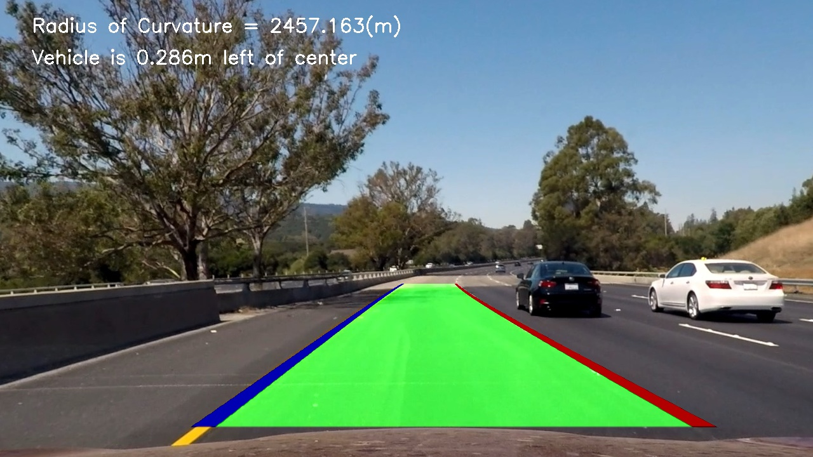
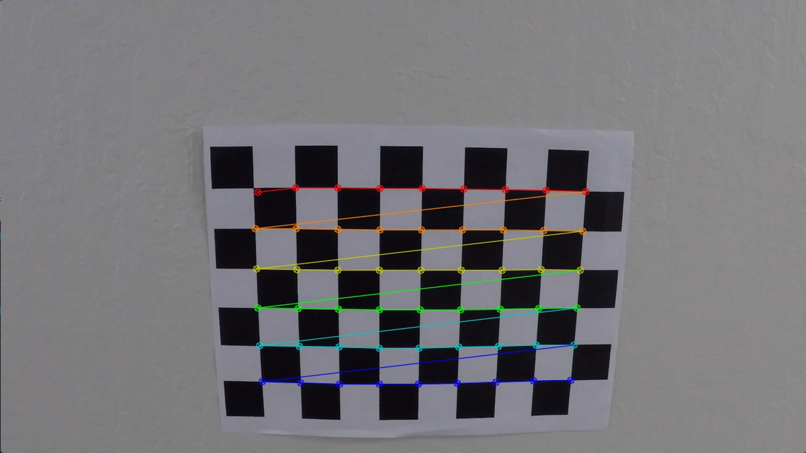
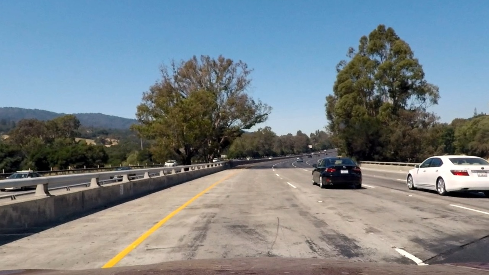
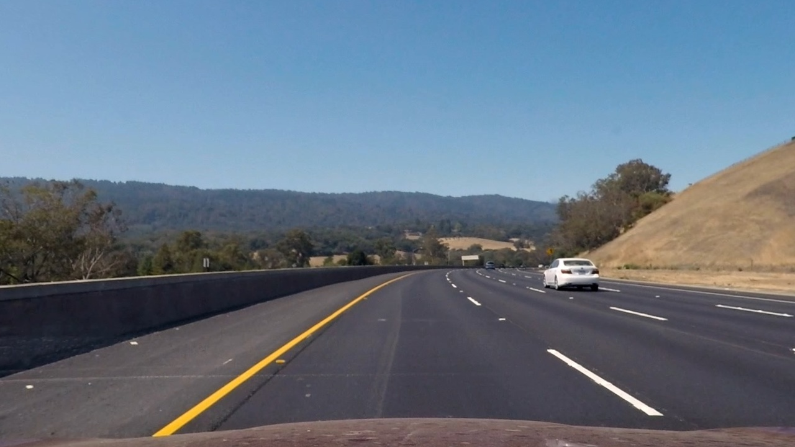
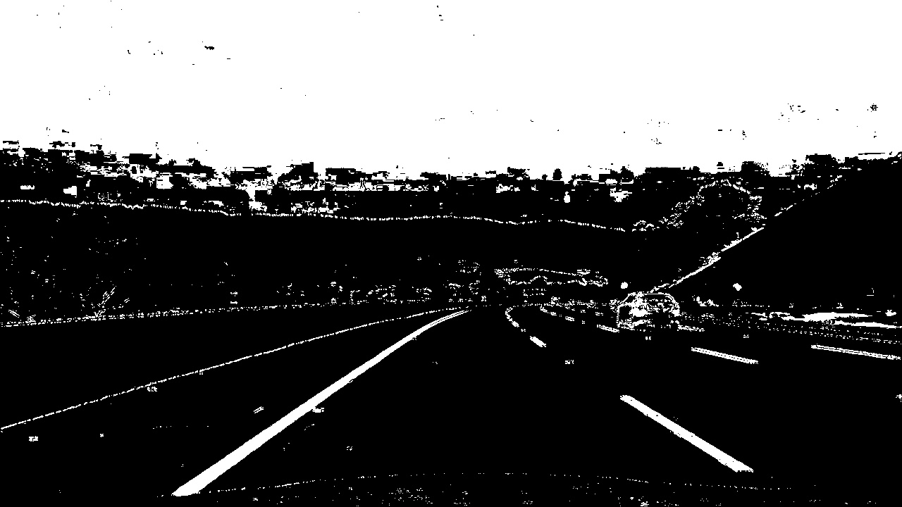
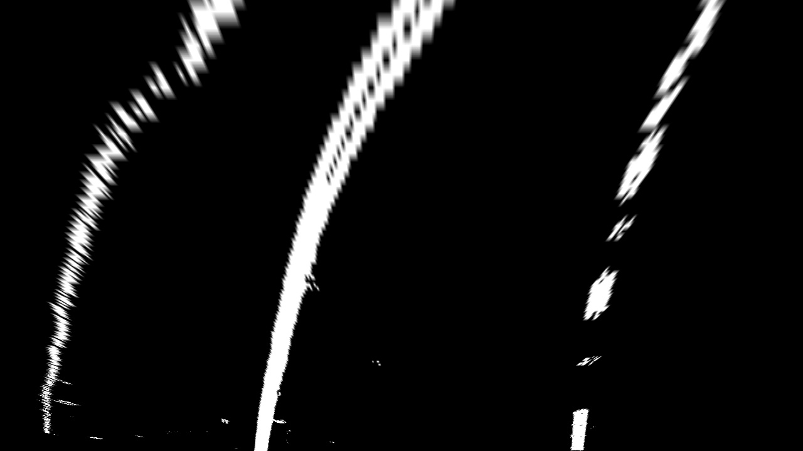
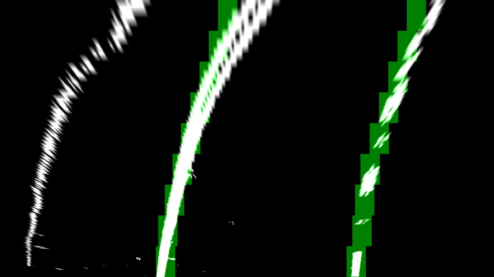
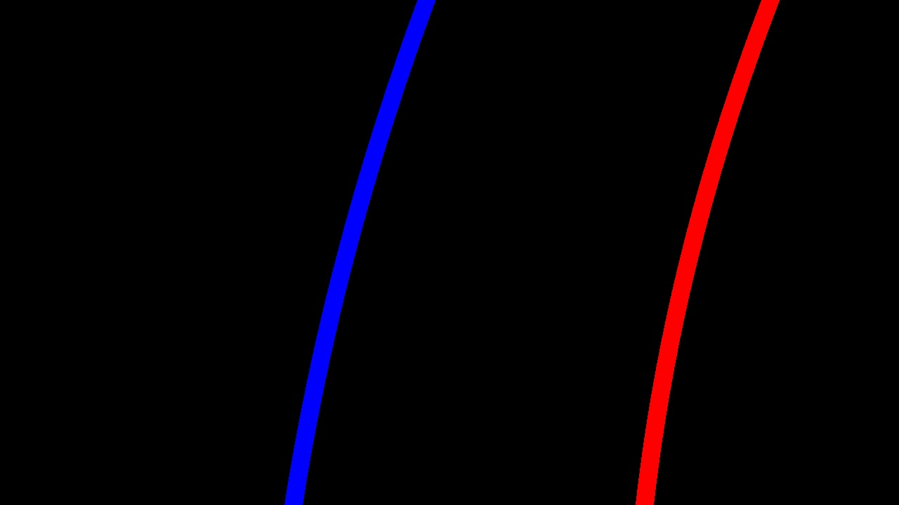
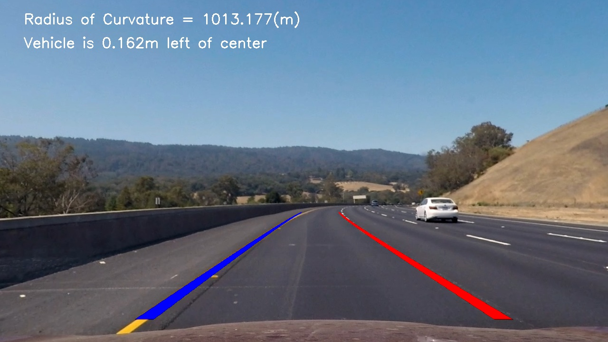
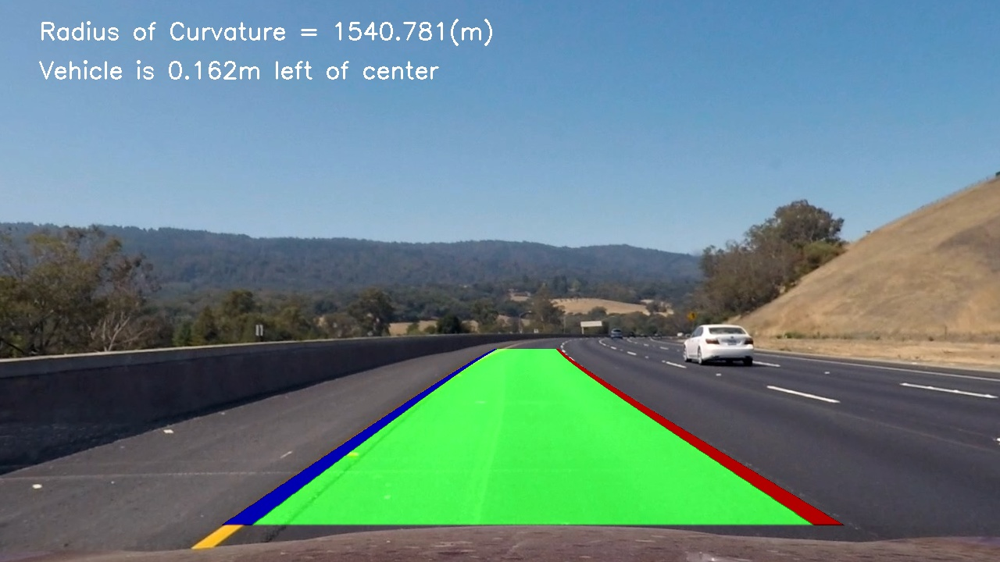

### I watched Udacity video session for advanced lane finding:
https://www.youtube.com/watch?v=vWY8YUayf9Q&feature=youtu.be
This work is based on the codes appeared on videos, but examined line by line to understand. 

## Advanced Lane Finding

---

**Advanced Lane Finding Project**

The goals / steps of this project are the following:

* Compute the camera calibration matrix and distortion coefficients given a set of chessboard images.
* Apply a distortion correction to raw images.
* Use color transforms, gradients, etc., to create a thresholded binary image.
* Apply a perspective transform to rectify binary image ("birds-eye view").
* Detect lane pixels and fit to find the lane boundary.
* Determine the curvature of the lane and vehicle position with respect to center.
* Warp the detected lane boundaries back onto the original image.
* Output visual display of the lane boundaries and numerical estimation of lane curvature and vehicle position.

[//]: # (Image References)

[image1]: ./examples/undistort_output.png "Undistorted"
[image2]: ./test_images/test1.jpg "Road Transformed"
[image3]: ./examples/binary_combo_example.jpg "Binary Example"
[image4]: ./examples/warped_straight_lines.jpg "Warp Example"
[image5]: ./examples/color_fit_lines.jpg "Fit Visual"
[image6]: ./examples/example_output.jpg "Output"
[video1]: ./project_video.mp4 "Video"

## [Rubric](https://review.udacity.com/#!/rubrics/571/view) Points

### Here I will consider the rubric points individually and describe how I addressed each point in my implementation.  

---

### Camera Calibration

### 0. Compute the camera calibration matrix and distortion coefficients given a set of chessboard images.

import a function that takes an image, object points, and image points performs the camera calibration, image distortion correction and 
returns the undistorted image




#### 1. Apply a distortion correction to raw images.

The code for this step is contained in the first code cell of the IPython notebook located in "./cam_cal.py.ipynb". 

I start by preparing "object points", which will be the (x, y, z) coordinates of the chessboard corners in the world. Here I am assuming the chessboard is fixed on the (x, y) plane at z=0, such that the object points are the same for each calibration image.  Thus, `objp` is just a replicated array of coordinates, and `objpoints` will be appended with a copy of it every time I successfully detect all chessboard corners in a test image.  `imgpoints` will be appended with the (x, y) pixel position of each of the corners in the image plane with each successful chessboard detection.  

I then used the output `objpoints` and `imgpoints` to compute the camera calibration and distortion coefficients using the `cv2.calibrateCamera()` function.  I applied this distortion correction to the test image using the `cv2.undistort()` function and obtained this result (The file for this work is 'image_gen-undistort.py.ipynb'): 



#### 2. Use color transforms, gradients, etc., to create a thresholded binary image.

To demonstrate this step, I will describe how I apply the distortion correction to one of the test images like this one:


#### 3. Describe how (and identify where in your code) you used color transforms, gradients or other methods to create a thresholded binary image.  Provide an example of a binary image result.

I used a combination of color and gradient thresholds to generate a binary image (thresholding steps at lines # through # in `image_gen-color_gradient.py.ipynb`).  Here's an example of my output for this step. 



#### 4. Describe how (and identify where in your code) you performed a perspective transform and provide an example of a transformed image. 

The code for my perspective transform calls 'getPerspectiveTransform' function from 'cv2. The function takes as inputs an image (`img`), as well as source (`src`) and destination (`dst`) points.  I chose the hardcode the source and destination points in the following manner:

```python
 src = np.float32([[img.shape[1]*(.5-mid_width/2),img.shape[0]*height_pct],[img.shape[1]*(.5+mid_width/2),img.shape[0]*height_pct],[img.shape[1]*(.5+bot_width/2),img.shape[0]*bottom_trim],[img.shape[1]*(.5-bot_width/2),img.shape[0]*bottom_trim]])
    dst = np.float32([[offset, 0], [img_size[0]-offset, 0],[img_size[0]-offset, img_size[1]],[offset, img_size[1]]])
```
#### 5. Apply a perspective transform to rectify binary image ("birds-eye view").

I verified that my perspective transform was working as expected by drawing the `src` and `dst` points onto a test image and its warped counterpart to verify that the lines appear parallel in the warped image.The associated file is 'image_gen-perspective_transform.py.ipynb'



#### 6. Detect lane pixels and fit to find the lane boundary.

Then found the lane line('image_gen-identify_lane_finding.py.ipynb) with a 2nd order polynomial ('image_gen-identify_lane_finding_polynominal.py.ipynb') this:




#### 7. Determine the curvature of the lane and vehicle position with respect to center.

I did this @ my code ( `image_gen-Camera_Center_Cal_Curvature.py.ipynb`)



#### 8. Provide an example image of your result plotted back down onto the road such that the lane area is identified clearly.

Here is an example of my result on a test image:



---

### Pipeline (video)

#### 1. Output visual display of the lane boundaries and numerical estimation of lane curvature and vehicle position.

Here's a [video result](./output_videos/output1_project_video.mp4)

---

### Discussion

#### 1. Briefly discuss any problems / issues you faced in your implementation of this project.  Where will your pipeline likely fail?  What could you do to make it more robust?

This is a truely challenging task. 
In order to tackle this various sources were referred:

- Python classes: the following on-line classes helped:
https://www.udemy.com/complete-python-bootcamp/
https://www.coursera.org/specializations/python

- Python book:
learn python 3.0 visually

- Several other learning materials:
https://wikidocs.net/book/110
https://www.youtube.com/playlist?list=PLEA1FEF17E1E5C0DA

Tried to implement magnitude & directional gradient to detect edge along with sobel/ color thresholding, but the result doesn't promissing, therefore, use only sobel/color threshold based edge detection. 

Learning progress for this specific nano degree as well as other fundamental learning (C/Python/Tensorflow/Keras) is tracked in the google sheet: 

https://docs.google.com/spreadsheets/d/1ZMtaS0Ifh5b9AcZpMV0RAKk8vmG7To65acA2ZQdAIHE/edit?usp=sharing


